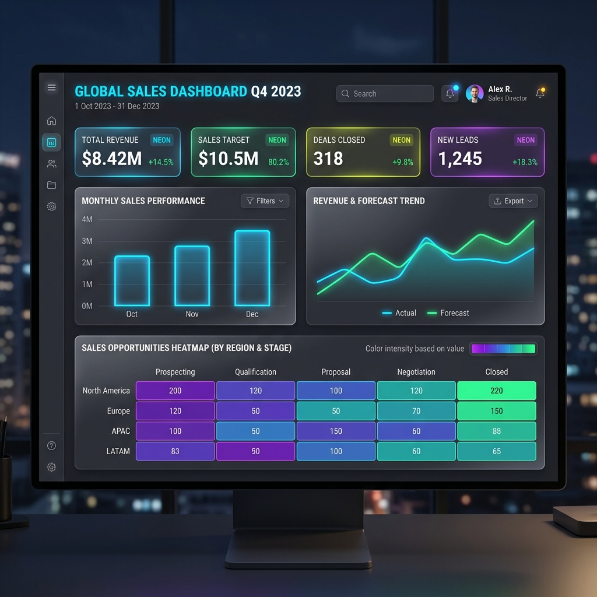

<div align="center">

# SALES PERFORMANCE & FORECASTING DASHBOARD

*An end-to-end interactive dashboard replacing manual Excel reporting, built for Parasnath Distribution Group.*


*Built with the tools and technologies:*


</div>

---

<div align="center">
  
</div>

---

## What This Is

An end-to-end **Sales Performance & Forecasting Dashboard** for **Parasnath Distribution Group**, built as a **modern web application** with a **FastAPI backend** and a **Next.js (TypeScript) frontend**. It replaces manual Excel-based sales reporting with an interactive dashboard that:

- Tracks **16 KPIs** across revenue, profitability, and operations
- Visualizes **regional** and **product-level** performance
- **Forecasts revenue** using Facebook Prophet with Indian holiday effects
- **Detects anomalies** via Z-score analysis
- Provides **contribution margin** and profitability views

Built as part of the Technical Internship Program 2026 (MPSTME NMIMS Mumbai × Parasnath Distribution Group).

---

## Features

### Core Functionality

- **KPI Overview:** 8 metric cards (Revenue, Margin, AOV, Velocity, Discounts, Repeat Rate, Transactions, Unique Customers) and monthly revenue area chart.
- **Regional Analysis:** Donut chart of revenue by region and interactive territory detail lists.
- **Product Performance:** Category margins, top 10 SKUs, and bottom 10 SKUs charts.
- **Trend Analysis:** Daily revenue line chart with interactive grouping controls and 30-day/90-day moving averages.
- **Sales Forecasting:** Prophet forecast with confidence intervals, horizon slider, and out-of-sample MAPE evaluation.
- **Anomaly Detection:** Revenue anomaly timeline and daily anomalous logs table.
- **Margins & Profit:** Category return rates, Online vs. Offline channel mix, and festive season revenue uplift.

---

## Quick Start

### 1. Clone & Set Up Python Environment
```bash
git clone https://github.com/1234620/sales-dashboard.git
cd sales-dashboard

# Virtual environment
python3 -m venv venv
source venv/bin/activate        # macOS/Linux
# venv\Scripts\activate         # Windows

# Install dependencies
pip install -r requirements.txt
```

### 2. Generate Synthetic FMCG Data
```bash
# Generates ~82K realistic B2B FMCG transactions based on real stock reports
python3 generate_data.py
```

### 3. Start the FastAPI Backend
```bash
python3 backend/main.py
# Runs at http://localhost:8000
```

### 4. Start the Next.js Frontend
```bash
cd frontend
npm install
npm run dev
# Opens at http://localhost:3000
```

---

## Architecture

```text
sales-dashboard/
├── backend/
│   └── main.py             # FastAPI backend API serving filtered KPI/chart data
├── frontend/
│   ├── app/                # Next.js App Router (TypeScript pages)
│   ├── src/                # Shared components, hooks, and API client
│   ├── package.json        # Frontend dependencies (Recharts, Radix, Tailwind)
│   └── tsconfig.json       # TypeScript config
├── config.py               # Centralized configuration (FMCG categories, stock weights)
├── generate_data.py        # Synthetic B2B data generator (~82K transactions)
├── requirements.txt        # Pinned Python dependencies
├── packages.txt            # System dependencies
├── .gitignore
│
├── src/
│   ├── __init__.py
│   ├── data.py             # Data loading, validation, and filtering pipeline
│   ├── kpis.py             # 16 KPI computation functions (pure, testable)
│   ├── viz.py              # Helper Plotly viz (historical reference)
│   └── forecast.py         # Prophet model: train, predict, evaluate (MAPE)
│
├── tests/
│   ├── __init__.py
│   └── test_kpis.py        # Unit tests for KPI functions (runs on pytest)
│
└── data/
    ├── processed/          # Cleaned master dataset
    └── synthetic/          # Generated synthetic dataset (CSV)
```

### Key Design Decisions

| Decision | Rationale |
|----------|-----------|
| **Next.js & FastAPI Separation** | Separates the data processing (Python/Pandas/Prophet) from UI rendering (Next.js/TypeScript) for a responsive, production-ready interface. |
| **All KPIs are pure functions** | Keep core math inside `src/kpis.py` pure and framework-agnostic so that unit tests can run independently. |
| **`config.py` centralizes everything** | Centralizes category weights, B2B price ranges, festive season windows, and validation parameters. |
| **React-recharts visualization** | Interactive, smooth vector graphs natively integrated in the React lifecycle. |
| **Lakhs / Crores formatting** | Uses standard Indian number formatting (`Cr`, `L`, `K`) to represent B2B FMCG revenues. |
| **Prophet caching on backend** | Retraining Facebook Prophet on every click is slow; the model is computed/cached dynamically. |

---

## Running Tests

```bash
python3 -m pytest tests/ -v
```

Tests cover: total revenue, AOV, discount rate, MoM growth, regional share, repeat purchase rate, return rates, channel mix, and sales velocity.

---

## What's Done vs. What's Next

### Completed
- Project scaffolding and Next.js / FastAPI separation
- Centralized configuration (`config.py`)
- Python data ingestion, cleaning, and quality pipeline
- 16 KPI computations and Prophet forecasting
- Premium dark-theme Next.js dashboard with responsive Tailwind grid
- Fully integrated control panel and filter pills (Region, Category, Channel, Date Range)
- Unit tests for KPIs

### Next Steps
- Implement user authentication for client portals
- Connect live ERP database to substitute synthetic data
- Generate PDF/CSV data exports from the frontend

---

## Author

**Ahmed Moosani**  
MBA Tech (Artificial Intelligence) — Semester VII  
MPSTME, NMIMS Mumbai  

Internship: Parasnath Distribution Group (18 May – 11 July 2026)  
Department: Business Analytics / Strategy
