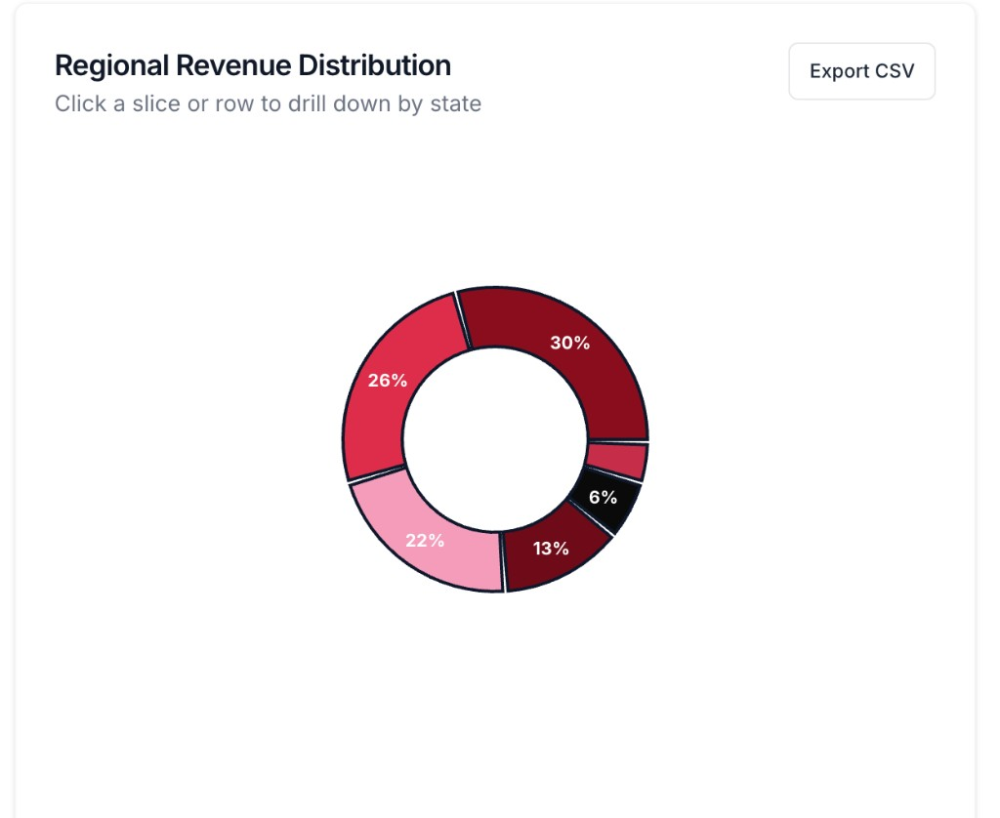

<div align="center">

# SALES PERFORMANCE & FORECASTING DASHBOARD

*An end-to-end interactive dashboard replacing manual Excel reporting, built for Parasnath Distribution Group.*


*Built with the tools and technologies:*


</div>

---

<div align="center">
  
  <p><em>Regional Revenue Distribution tab — Next.js dashboard (live UI screenshot)</em></p>
</div>

---

## What This Is

An end-to-end **Sales Performance & Forecasting Dashboard** for **Parasnath Distribution Group**, built as a **modern web application** with a **FastAPI backend** and a **Next.js (TypeScript) frontend**. It replaces manual Excel-based sales reporting with an interactive dashboard that:

- Tracks **16 KPIs** across revenue, profitability, and operations
- Visualizes **regional** and **product-level** performance
- **Forecasts revenue** using Facebook Prophet with Indian holiday effects
- **Detects anomalies** via Z-score analysis
- Provides **contribution margin** and profitability views

Built as part of the Technical Internship Program 2026 (MPSTME NMIMS Mumbai × Parasnath Distribution Group).

> **Official UI:** The dashboard runs on the **Next.js 16 + TypeScript** app in [`frontend/`](frontend/).  
> The original **Streamlit prototype** (`app.py`, Plotly charts) has been **removed** — do not run `streamlit run`.  
> All chart readability fixes (Phase 2) and tab components live under `frontend/src/components/dashboard/`.

---

## Features

### Core Functionality

- **Landing page:** Branded hero with floating dashboard preview and CTA to open the analytics app.
- **KPI Overview:** 8 metric cards (Revenue, Margin, AOV, Velocity, Discounts, Repeat Rate, Transactions, Unique Customers) and monthly revenue area chart.
- **Regional Analysis:** Donut chart of revenue by region and interactive territory detail lists.
- **Product Performance:** Category margins, top 10 SKUs, and bottom 10 SKUs charts.
- **Trend Analysis:** Daily revenue line chart with interactive grouping controls and 30-day/90-day moving averages.
- **Sales Forecasting:** Prophet forecast with confidence intervals, horizon slider, and out-of-sample MAPE evaluation.
- **Anomaly Detection:** Revenue anomaly timeline and daily anomalous logs table.
- **Margins & Profit:** Category return rates, Online vs. Offline channel mix, and festive season revenue uplift.

---

## Quick Start

### 1. Clone & Set Up Python Environment
```bash
git clone https://github.com/1234620/sales-dashboard.git
cd sales-dashboard

# Virtual environment
python3 -m venv venv
source venv/bin/activate        # macOS/Linux
# venv\Scripts\activate         # Windows

# Install dependencies
pip install -r requirements.txt
```

### 2. Generate Synthetic FMCG Data
```bash
# Generates ~100K realistic B2B FMCG transactions (2023-01-01 → 2026-04-30)
python3 generate_data.py
# Also writes data/processed/sales_clean.csv
```

### 3. Start the FastAPI Backend (required)
```bash
# From the repo root — serves KPI/chart JSON at http://localhost:8000
python3 backend/main.py
```

### 4. Start the Next.js Frontend (this is the dashboard UI)
```bash
cd frontend
npm install          # first time only
npm run dev
# Open http://localhost:3000          ← landing page
# Open http://localhost:3000/dashboard ← dashboard directly
```

**You need both processes running:** FastAPI on `:8000` and Next.js on `:3000`. The TypeScript frontend fetches all data from the Python API.

---

## Architecture

```text
sales-dashboard/
├── backend/
│   └── main.py             # FastAPI API — KPIs, charts, forecast, anomalies
├── frontend/               # ★ OFFICIAL DASHBOARD UI (Next.js 16 + TypeScript)
│   ├── app/                # App Router — landing (`page.tsx`) + dashboard (`dashboard/page.tsx`)
│   └── src/
│       ├── components/dashboard/
│       │   ├── tabs/       # One component per dashboard tab (Overview, Regional, …)
│       │   ├── FilterPanel.tsx
│       │   └── chart-primitives.tsx
│       ├── lib/            # API client, types, chart-utils, format helpers
│       └── hooks/
├── config.py               # FMCG categories, holidays, forecast settings
├── generate_data.py        # Synthetic B2B data generator (~100K transactions)
├── requirements.txt        # Python deps (no Streamlit)
│
├── src/
│   ├── data.py             # Data loading, validation, filtering
│   ├── process_data.py     # Copy synthetic → processed/sales_clean.csv
│   ├── kpis.py             # 16 KPI computation functions (pure, testable)
│   └── forecast.py         # Prophet: train, predict, MAPE evaluation
│
├── tests/
│   ├── test_kpis.py
│   ├── test_api.py
│   └── test_generate_data.py
│
└── data/
    ├── processed/
    └── synthetic/
```

**Removed (legacy):** `app.py` (Streamlit), `src/viz.py` (Plotly helpers) — replaced by Recharts components in `frontend/`.

### Key Design Decisions

| Decision | Rationale |
|----------|-----------|
| **Next.js is the only frontend** | Streamlit was a prototype; production UI is TypeScript + Recharts in `frontend/`. |
| **Next.js & FastAPI separation** | Python handles Pandas/Prophet; React handles rendering and interactivity. |
| **All KPIs are pure functions** | Keep core math inside `src/kpis.py` pure and framework-agnostic so that unit tests can run independently. |
| **`config.py` centralizes everything** | Centralizes category weights, B2B price ranges, festive season windows, and validation parameters. |
| **React-recharts visualization** | Interactive, smooth vector graphs natively integrated in the React lifecycle. |
| **Lakhs / Crores formatting** | Uses standard Indian number formatting (`Cr`, `L`, `K`) to represent B2B FMCG revenues. |
| **Prophet caching on backend** | Prophet trains once at FastAPI startup (`src/model_cache.py`); `/api/forecast` reuses the cached model. Use `POST /api/forecast/refresh` to retrain after data changes. |

---

## Running Tests

```bash
python3 -m pytest tests/ -v
```

Tests cover: KPI unit tests (`test_kpis.py`) and API integration tests (`test_api.py`) — health, KPIs, YoY growth, anomaly payloads, and forecast cache behavior.

---

## What's Done vs. What's Next

### Completed
- Project scaffolding and Next.js / FastAPI separation (Streamlit removed)
- Centralized configuration (`config.py`)
- Python data ingestion, cleaning, and quality pipeline (`src/data.py`, `src/process_data.py`)
- Phase 5 synthetic data realism: price inflation, reorder cadence, period-end spikes, region×channel bias, stockouts
- 16 KPI computations and Prophet forecasting
- Premium light-theme **Next.js / TypeScript** dashboard with landing page and maroon brand palette
- Phase 6: CSV/PDF export, region→state drill-down, compare-to-prior-period, insights panel, category heatmap
- Phase 2 chart readability fixes (Recharts: axis labels, confidence bands, SKU tooltips, dynamic MAPE, etc.)
- Phase 4 backend: Prophet model cache, YoY growth API, festive uplift & margin KPI fixes, anomaly `flagged_only` param
- Anomalies tab: flagged table pagination (10 rows/page, Previous/Next)
- Fully integrated control panel and filter pills (Region, Category, Channel, Date Range)
- Unit tests for KPIs, API, and generator helpers

### Next Steps
- Implement user authentication for client portals
- Connect live ERP database to substitute synthetic data

---

## Author

**Ahmed Moosani**  
MBA Tech (Artificial Intelligence) — Semester VII  
MPSTME, NMIMS Mumbai  

Internship: Parasnath Distribution Group (18 May – 11 July 2026)  
Department: Business Analytics / Strategy
